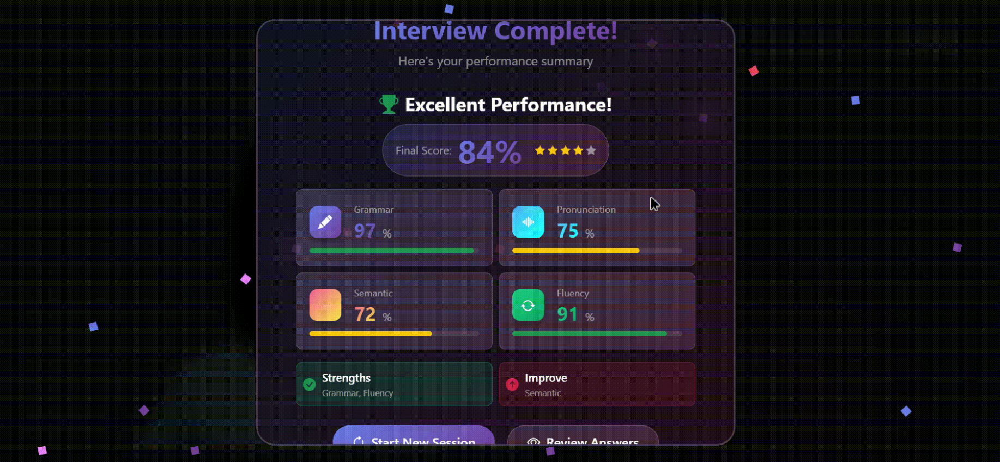

# Avatar Assistant

A 3D avatar-powered English interview practice application with real-time speech analysis, lip-sync animation, and AI-powered feedback.

## Features

- **3D Avatar Integration**: Ready Player Me avatars with realistic lip-sync animation
- **Speech Recognition**: Real-time transcription using Faster Whisper
- **AI-Powered Analysis**: Grammar, pronunciation, semantic, and fluency scoring
- **Text-to-Speech**: Natural voice synthesis with viseme generation for lip-sync
- **Interactive Interview**: Mock interview sessions with adaptive feedback
- **User Authentication**: Secure login/signup system
- **Progress Tracking**: Session-based scoring and improvement analytics

## Demo 
Homepage

Onboarding

Avatar


## Video Demo
## Avatar with lip-sync
Click on the image to see video
[](https://vimeo.com/1123628327)

## Final Scores


## Tech Stack

### Frontend
- **React 18** with Vite
- **Three.js** + **@react-three/fiber** for 3D rendering
- **@react-three/drei** for 3D utilities
- **Bootstrap 5** for UI components
- **React Router** for navigation
- **Axios** for API communication

### Backend
- **Flask** with Python 3.12
- **MongoDB** for data storage
- **Google Gemini AI** for grammar analysis
- **Faster Whisper** for speech-to-text
- **pyttsx3** for text-to-speech
- **Rhubarb Lip Sync** for viseme generation
- **aiortc** for WebRTC support

## Prerequisites

- **Python 3.12+**
- **Node.js 18+**
- **MongoDB** (local or cloud)
- **Rhubarb Lip Sync** executable
- **Google AI API Key**

## Installation

### 1. Clone Repository
```bash
git clone <repository-url>
cd avatar-assistant
```

### 2. Backend Setup
```bash
cd backend
pip install -r requirements.txt
```

### 3. Frontend Setup
```bash
cd frontend
npm install
```

### 4. Environment Configuration
Create `backend/.env` file:
```env
GOOGLE_API_KEY=your_google_ai_api_key
MONGODB_URI=mongodb://localhost:27017
MONGODB_DB=avatar_assistant
WHISPER_MODEL=base
WHISPER_COMPUTE_TYPE=auto
HEYGEN_API_KEY=your_heygen_api_key
TTS_PROVIDER=pyttsx3
RHUBARB_PATH=path/to/rhubarb.exe
```

### 5. Rhubarb Lip Sync Setup
1. Download [Rhubarb Lip Sync](https://github.com/DanielSWolf/rhubarb-lip-sync/releases)
2. Extract and set `RHUBARB_PATH` in `.env`

## Running the Application

### Start Backend
```bash
cd backend
python -m app.main
```
Backend runs on `http://localhost:8000`

### Start Frontend
```bash
cd frontend
npm run dev
```
Frontend runs on `http://localhost:5173`

## Project Structure

```
avatar-assistant/
├── backend/
│   ├── app/
│   │   ├── routes/          # API endpoints
│   │   │   ├── auth.py      # Authentication
│   │   │   ├── session.py   # Interview sessions
│   │   │   ├── check.py     # Answer analysis
│   │   │   ├── tts.py       # Text-to-speech
│   │   │   └── onboarding.py
│   │   ├── services/        # Core services
│   │   │   ├── tts.py       # TTS with visemes
│   │   │   ├── stt.py       # Speech-to-text
│   │   │   ├── grammar.py   # Grammar analysis
│   │   │   ├── semantic.py  # Semantic scoring
│   │   │   ├── aligner.py   # Pronunciation
│   │   │   ├── moderation.py
│   │   │   └── gemini_client.py
│   │   ├── db/
│   │   │   └── mongo.py     # Database connection
│   │   └── main.py          # Flask app
│   ├── requirements.txt
│   └── .env
├── frontend/
│   ├── src/
│   │   ├── components/      # React components
│   │   │   ├── AvatarScene.jsx    # 3D avatar rendering
│   │   │   ├── InterviewPanel.jsx # Interview interface
│   │   │   ├── Onboarding.jsx     # User setup
│   │   │   └── ScoreReport.jsx    # Results display
│   │   ├── api/
│   │   │   └── apiClient.js # Backend communication
│   │   ├── services/
│   │   │   └── api.js       # API utilities
│   │   ├── styles/
│   │   │   └── theme.css    # Custom styles
│   │   ├── App.jsx          # Main app component
│   │   └── main.jsx         # Entry point
│   ├── package.json
│   └── vite.config.js
└── README.md
```

## API Endpoints

### Authentication
- `POST /api/auth/signup` - User registration
- `POST /api/auth/login` - User login
- `GET /api/auth/me` - Get user profile

### Interview Sessions
- `POST /api/session/start` - Start interview session
- `POST /api/session/end` - End session with scores

### Analysis
- `POST /api/check` - Analyze user response
- `POST /api/tts` - Generate speech with visemes

### User Management
- `GET /api/onboarding` - Get user preferences
- `POST /api/onboarding` - Save user setup

## Features in Detail

### 3D Avatar Lip Sync
- Real-time mouth movement using morph targets
- Viseme-based animation from Rhubarb Lip Sync
- Support for Ready Player Me avatars
- Enhanced movement visibility for clear lip sync

### Speech Analysis
- **Grammar**: AI-powered correction and scoring
- **Pronunciation**: Phonetic alignment analysis
- **Semantic**: Context relevance scoring
- **Fluency**: Speech rhythm and pace evaluation

### Voice Synthesis
- Local Windows TTS (pyttsx3) with female voice preference
- Automatic viseme generation for lip synchronization
- Fallback to browser speech synthesis
- Queue-based audio playback to prevent overlaps

### Interview Flow
1. User authentication and onboarding
2. Avatar selection and session start
3. Question presentation with TTS
4. Voice recording with automatic silence detection
5. Real-time analysis and feedback
6. Score-based progression and final report

## Configuration Options

### TTS Settings
- `TTS_PROVIDER=pyttsx3` - Use local Windows TTS
- `PYTTSX3_VOICE` - Specific voice name (optional)

### AI Analysis
- `GOOGLE_API_KEY` - For Gemini AI grammar analysis
- `STATIC_MODE=1` - Use fixed scores for testing

### Audio Processing
- `WHISPER_MODEL=base` - STT model size
- `WHISPER_COMPUTE_TYPE=auto` - Processing optimization

## Troubleshooting

### Common Issues

1. **TTS Not Working**
   - Ensure pyttsx3 is installed
   - Check Windows SAPI voices are available
   - Verify Rhubarb path is correct

2. **Avatar Not Loading**
   - Check Ready Player Me URL format
   - Ensure internet connection for avatar download
   - Verify Three.js dependencies

3. **Speech Recognition Fails**
   - Check microphone permissions
   - Ensure Faster Whisper model is downloaded
   - Verify audio format compatibility

4. **Database Connection**
   - Start MongoDB service
   - Check connection string in `.env`
   - Verify database permissions

### Debug Logging
The application includes comprehensive logging:
- Backend: TTS processing, viseme generation, API requests
- Frontend: Audio playback, viseme processing, avatar animation

## Development

### Adding New Features
1. Backend: Add routes in `app/routes/`, services in `app/services/`
2. Frontend: Add components in `src/components/`
3. Update API client for new endpoints

### Testing
- Backend: Use Postman or curl for API testing
- Frontend: Browser console shows detailed logs
- Integration: Test full interview flow
